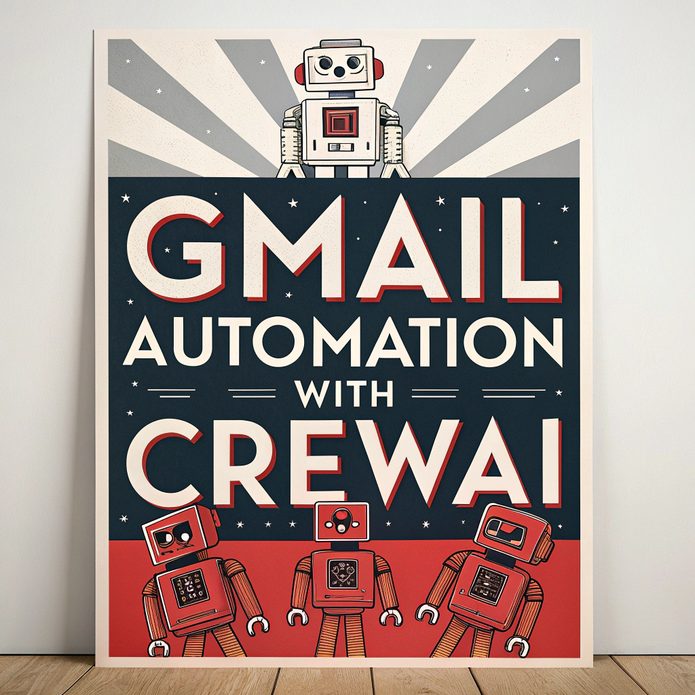

# Gmail Automation with CrewAI 📧✨

[](https://www.youtube.com/@tonykipkemboi)
[](https://github.com/tonykipkemboi)
[](https://twitter.com/tonykipkemboi)
[](https://www.linkedin.com/in/tonykipkemboi/)

Gmail Automation with CrewAI is an intelligent email management system that uses AI agents to categorize, organize, respond to, and clean up your Gmail inbox automatically using OAuth2 authentication.



## ✨ Features


 


- **📋 Email Categorization**: Automatically categorizes emails into specific types (newsletters, promotions, personal, etc.)
- **🔔 Priority Assignment**: Assigns priority levels (HIGH, MEDIUM, LOW) based on content and sender with strict classification rules
- **🏷️ Smart Organization**: Applies Gmail labels and stars based on categories and priorities
- **💬 Automated Responses**: Generates draft responses for important emails that need replies
- **🧹 Intelligent Cleanup**: Safely deletes low-priority emails based on age and category
- **🎬 YouTube Content Protection**: Special handling for YouTube-related emails
- **🗑️ Trash Management**: Automatically empties trash to free up storage space
- **🧵 Thread Awareness**: Recognizes and properly handles email threads
- **💳 Subscription Management**: Stripe-powered subscription system with usage-based limits
- **📊 Usage Tracking**: Daily email processing limits based on subscription tier
- **🔐 OAuth2 Authentication**: Secure multi-user Gmail access without app passwords

## 🚀 Installation

```bash
# Clone the repository
git clone https://github.com/tonykipkemboi/crewai-gmail-automation.git
cd crewai-gmail-automation

# Create and activate a virtual environment
python -m venv .venv
source .venv/bin/activate  # On Windows: .venv\Scripts\activate

# Install dependencies
crewai install
```

## ⚙️ Configuration

1. Create a `.env` file in the root directory with the following variables:

```env
# Choose your LLM provider
# OpenAI (Recommended)
MODEL=openai/gpt-4o-mini
OPENAI_API_KEY=your_openai_api_key

# Or Gemini
# MODEL=gemini/gemini-2.0-flash
# GEMINI_API_KEY=your_gemini_api_key

# Or Ollama  (Note: May have compatibility issues with tool calling)
# Download the model from https://ollama.com/library
# MODEL=ollama/llama3-groq-tool-use # use ones that have tool calling capabilities

# Stripe Configuration (for subscription management)
STRIPE_SECRET_KEY=sk_test_your_stripe_secret_key
STRIPE_PUBLISHABLE_KEY=pk_test_your_stripe_publishable_key
STRIPE_WEBHOOK_SECRET=whsec_your_webhook_secret
STRIPE_BASIC_PRICE_ID=price_basic_monthly
STRIPE_PREMIUM_PRICE_ID=price_premium_monthly
```

## 🔐 OAuth2 Setup

This application uses OAuth2 for secure Gmail authentication. Follow the [OAuth2 Setup Guide](OAUTH2_SETUP.md) to configure Google Cloud credentials and enable multi-user support.

## 🔍 Usage

### Streamlit Web Interface (Recommended)

```bash
streamlit run streamlit_app.py
```

This will open a web interface where you can:
- Authenticate multiple Gmail accounts via OAuth2
- Manage user sessions  
- Process emails with AI
- View processing results

### Command Line

For OAuth2 mode:
```bash
# Set the current user ID
export CURRENT_USER_ID=your_user_id

# Run the crew
crewai run
```

You'll be prompted to enter the number of emails to process (default is 5).

The application will:
1. 📥 Fetch your unread emails via OAuth2
2. 🔎 Categorize them by type and priority
3. ⭐ Apply appropriate labels and stars
4. ✏️ Generate draft responses for important emails
5. 🗑️ Clean up low-priority emails based on age
6. 🧹 Empty the trash to free up storage space

## 🌟 Special Features

- **📅 Smart Deletion Rules**: 
  - Promotions older than 2 days are automatically deleted
  - Newsletters older than 7 days (unless HIGH priority) are deleted
  - Shutterfly emails are always deleted regardless of age
  - Receipts and important documents are archived instead of deleted

- **🎬 YouTube Protection**: All YouTube-related emails are preserved and marked as READ_ONLY (you'll respond directly on YouTube)

- **✍️ Smart Response Generation**: Responses are tailored to the email context and include proper formatting

- **🧵 Thread Handling**: Properly tracks and manages email threads to maintain conversation context

## 👥 Contributing

Contributions are welcome! Please feel free to submit a [Pull Request](https://github.com/tonykipkemboi/crewai-gmail-automation/pulls).

## 💳 Subscription Plans

The application includes built-in subscription management with usage limits:

- **Free Tier**: 10 emails per day
- **Basic Plan**: 100 emails per day  
- **Premium Plan**: Unlimited emails

## 📁 File Structure

After setup, your project should look like:

```
gmail-crewai/
├── credentials.json          # OAuth2 credentials (keep secret!)
├── tokens/                   # User tokens directory (auto-created)
│   ├── user1_abc123_token.pickle
│   └── user2_def456_token.pickle
├── output/                   # Processing results (auto-created)
├── streamlit_app.py         # Main web interface
├── requirements.txt         # Dependencies
├── .env                     # Environment variables
├── .gitignore              # Include credentials.json here!
└── src/gmail_crew_ai/      # Main application code
```

## 🔒 Security Features

- **OAuth2 Authentication**: No app passwords required
- **Token Storage**: OAuth2 tokens are stored locally in encrypted format
- **Automatic Refresh**: Tokens are automatically refreshed when needed
- **Revocation**: Users can revoke access at any time
- **Local Processing**: All AI processing happens locally with your OpenAI key
- **No Data Storage**: Email content is not permanently stored

## 🛠️ Troubleshooting

### PowerShell PSReadLine Error Fix

If you encounter a PowerShell error about `PredictionSource` parameter when using Warp terminal, this is due to PSReadLine version compatibility. We've included a fix:

1. **Automatic Fix**: Run the provided installer:
   ```bash
   # Install the profile for current user
   powershell.exe -ExecutionPolicy Bypass -File install-profile.ps1
   ```

2. **Manual Fix**: Copy `profile.ps1` to your PowerShell profile location:
   ```powershell
   # Find your profile location
   $PROFILE
   
   # Copy the profile (create directory if needed)
   $profileDir = Split-Path $PROFILE -Parent
   if (!(Test-Path $profileDir)) { New-Item -ItemType Directory -Path $profileDir -Force }
   Copy-Item "profile.ps1" $PROFILE -Force
   ```

3. **How it works**:
   - Detects your PSReadLine version automatically
   - Uses `PredictionSource` parameter only if PSReadLine >= 2.2
   - Falls back to compatible options for older versions (like PSReadLine 2.0)
   - Eliminates the parameter error completely

4. **Restart** your PowerShell session or Warp terminal after installation.

See the [OAuth2 Setup Guide](OAUTH2_SETUP.md) for detailed troubleshooting steps.

## 🆘 Getting Help

If you encounter issues:

1. Check the OAuth2 setup guide
2. Verify your Google Cloud Console setup
3. Review the application logs in the Streamlit interface
4. Check that all environment variables are set correctly

---

**🎉 Ready to automate your Gmail with AI!** Your intelligent email assistant is ready to help you manage emails efficiently and securely.

